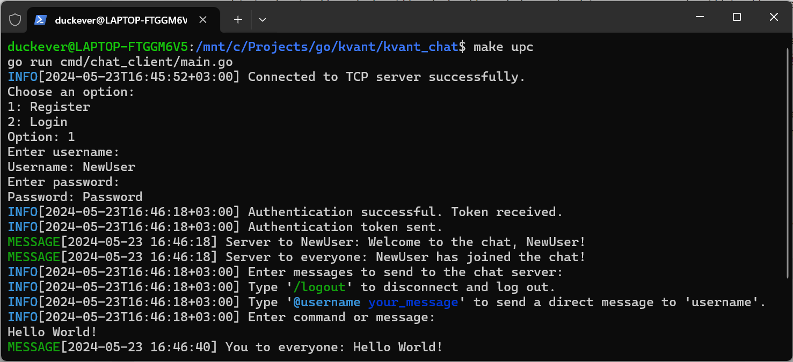

# Kvant Chat App

## Overview
Kvant Chat is a real-time chat application that provides both TCP and HTTP interfaces for communication. Users register or log in via the HTTP interface to obtain a JWT token. 

Once authenticated, they use this token to establish a connection over TCP. After the initial authentication, users can participate in the chat without further token checking or renewal within the session. 

The application supports a general chat room where messages can be broadcasted to all connected users. Additionally, users can send direct messages to specific users by prefixing their message with `@username`. 

## Configuration
The app requires certain environment variables to be set for its operation, which are specified in the `.env` file. This file includes configurations for database connections, JWT secret key for authentication, and server port settings. 

## Docker Setup
The application uses Docker to simplify the setup of the PostgreSQL database. The `docker-compose.yml` file in the `deploy/local` directory defines the service configuration for the database and environment setup.

## Migrator
The migrator initializes and manages the PostgreSQL database schema automatically at startup, ensuring that the database structure is always up-to-date with the application's requirements.

## Makefile Commands
The `Makefile` includes several commands to facilitate easy setup, development, and testing of the application.

### Key Makefile Commands
- `help`: Displays available commands for managing the application lifecycle and environment.
- `tools`: Installs necessary tools for code formatting, linting, and compilation.

## Getting Started
1. **Running the Server**: Execute `make ups` to start the server using `go run`.
2. **Running the Client**: To start the client, use `make upc`.

## Testing
- Use `make test` to run all tests, including unit.
- For integration tests, use `make itest` or `make itestv` for verbose output.

## Cleaning Up
- To stop the application and clean up the environment, use `make down`.

## Developer Tools
- Use `make tidy` to format and tidy up the Go code.
- Use `make lint` for linting the project to ensure code quality.
Maybe you'll need install it using `make tools`

## Contact Information
For further inquiries or direct communication, feel free to reach out via Telegram: [@duckever](https://t.me/duckever).
